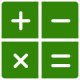

 

  

<h3 align="center">Calculator | The Odin Project</h3>

  

    A basic Calculator
     
     
    <a href="https://adrianogtl.github.io/top-calculator/">View demo</a>
    &nbsp;•&nbsp;
    <a href="https://www.theodinproject.com/lessons/foundations-calculator">The Odin Project</a>
  

## About

- This project is part of the Foundations Course from The Odin Project

## Acknowledgments

- <a target="_blank" href="https://icons8.com/icon/9470/math">Math</a> icon by <a target="_blank" href="https://icons8.com">Icons8</a>
